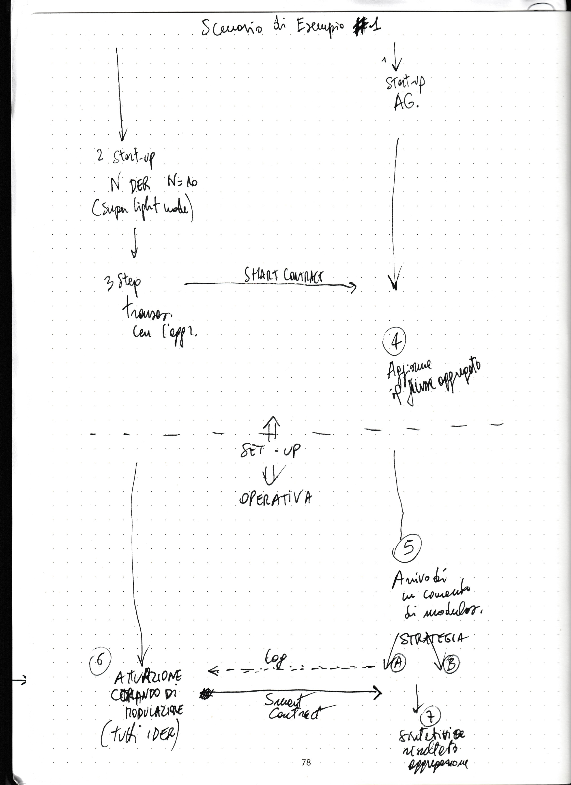

# EW DER Simulator

[](https://github.com/TendTo/EW-DER-Simulator/actions/workflows/electron.yml)
[](https://github.com/TendTo/EW-DER-Simulator/actions/workflows/contract-tests.yml)
[](https://codecov.io/gh/TendTo/EW-DER-Simulator)

Simulate the interaction of DERs with the Energy Web testnet (Volta)

## 🖥 Installation

### 🧾 Requirements

- [git](https://git-scm.com/)
- [NodeJs 16.x](https://nodejs.org/)
- [npm](https://www.npmjs.com/)

### ⌨️ Steps

```bash
# Clone the repository
git clone https://github.com/TendTo/EW-DER-Simulator.git
# Move in the root directory of the project
cd EW-DER-Simulator
# Install all the project's dependencies
npm install
# Compile all the smart contracts and generate the typings
npm run compile
# Deploy the smart contract on the Volta blockchain
npm run deploy:volta
# Start the electron application
npm start
```

## 🧪 Test

```bash
npm test
```

## Nethermind node

### Installation

[Hardware requirements](https://docs.nethermind.io/nethermind/first-steps-with-nethermind/hardware-requirements)  
[Docs](https://docs.nethermind.io/nethermind/first-steps-with-nethermind/getting-started#installing-and-launching-nethermind)

```bash
# On debian based distro
sudo add-apt-repository ppa:nethermindeth/nethermind
sudo apt install nethermind

# On MacOs
brew tap nethermindeth/nethermind
brew install nethermind
```

It is also possible to download the packages from the [official site](https://downloads.nethermind.io/) for other platforms, like Windows.

### Launch

Make sure the application is installed correctly and is on the $PATH env variable.

```bash
nethermind --config volta --Init.WebSocketsEnabled true --JsonRpc.WebSocketsPort 8545 --JsonRpc.Enabled true --JsonRpc.Host 0.0.0.0
```

#### Command options:
- **config:** which blockchain to connect to. There are many options, like Mainnet and Ropsten, but we use volta
- **JsonRpc.Enabled:** enables the JsonRpc functionalities
- **Init.WebSocketsEnabled:** enables the connection via websockets
- **JsonRpc.WebSocketsPort:** the port the JsonRpc node will listen on
- **JsonRpc.Host:** only accept connections from this IP. 0.0.0.0 means _accept from anyone_. **It would be more secure to specify a single IP**

Other more specific options are available [here](https://docs.nethermind.io/nethermind/ethereum-client/configuration)

## Flow



### Todo

- [x] Interazione con la blockchain Volta
- [x] Registrazione di un agreement all'avvio
- [x] Differenziare il numero di DER per tipologia
- [ ] Aggiungere funzionalità di flessibilità
- [x] Aggiungere possibilità di imprevisti
- [ ] Rimanere in attesa di Log di flessibilità
- [x] Aggiungere la visualizzazione dei Log degli agreement
- [x] Aggiungere scala temporale
- [x] Aggiungere misura aggregata
- [ ] Aggiungere label del singolo DER
- [x] Aggiungere i pulsanti di chiusura della finestra
- [ ] Verificare il fallimento di registrazioni degli agreement
- [x] Aggiungere un sistema di notifiche frontend
- [ ] Possibilità di modificare il numero di DER durante la simulazione
- [x] Aggiungere counter per DER attualmente attivi (che hanno completato la transazione di agreement)
- [x] Aggiungere baseline energia aggregatore
- [x] Riportare solo l'ora nel grafico
- [x] Aumentare la finestra di grafico (magari tramite aggregazione di dati)
- [x] Grafico fissato attorno alla baseline
- [x] Aggiungere un nodo Volta separato a cui i DER fanno riferimento
- [x] Log flessibilità: [2022-08-02T16:46:04.521] [DEBUG] flexibility - 0,25,97,95,95,1
- [ ] Average flexibility in percentuale
- [ ] Pause button

## ⛏ Tools

- [NodeJs 16.x](https://nodejs.org/)
- [electron](https://www.electronjs.org/)
- [hardhat](https://hardhat.org/)
- [Nethermind](https://nethermind.io/)
- [etherjs](https://docs.ethers.io/v5/single-page/)

## 📚 Reference

- [Run local RPC node](https://energy-web-foundation.gitbook.io/energy-web/how-tos-and-tutorials/running-a-local-node)
- [What is a Blockchain Node Provider? Why Do I Need One?](https://www.alchemy.com/blog/what-is-a-node-provider)
- [Hierarchical key generation](https://alexey-shepelev.medium.com/hierarchical-key-generation-fc27560f786)
