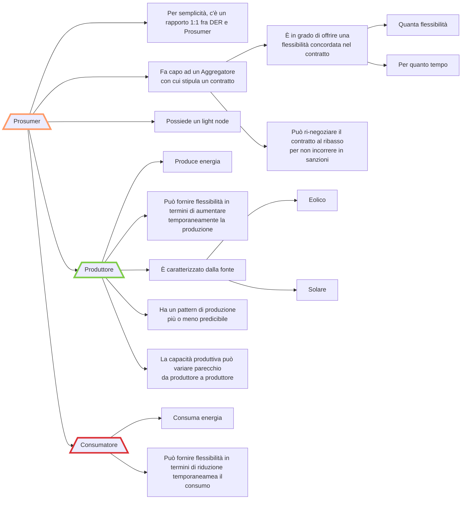
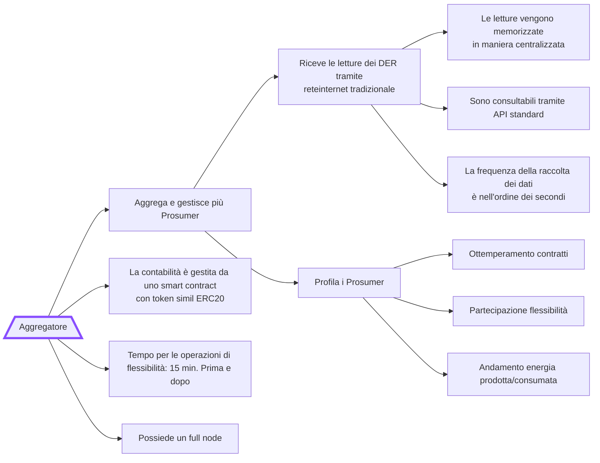
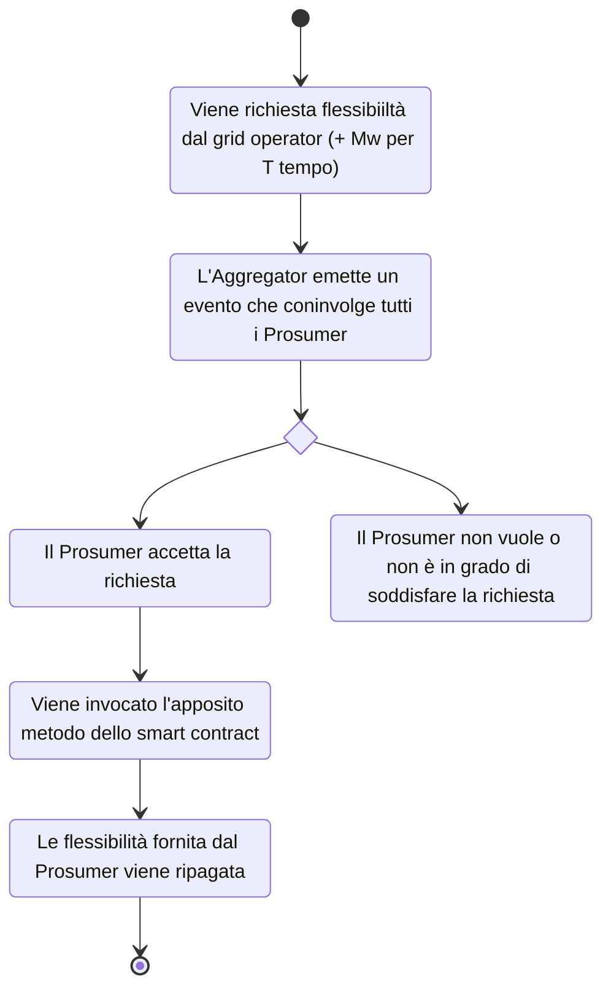
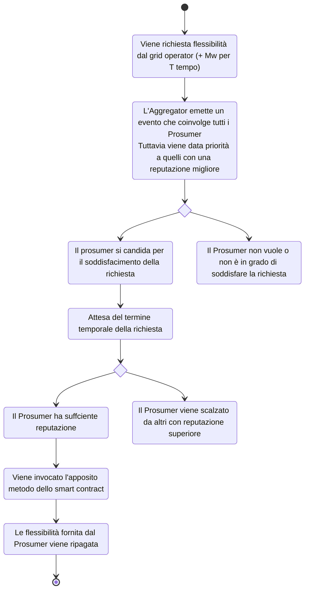
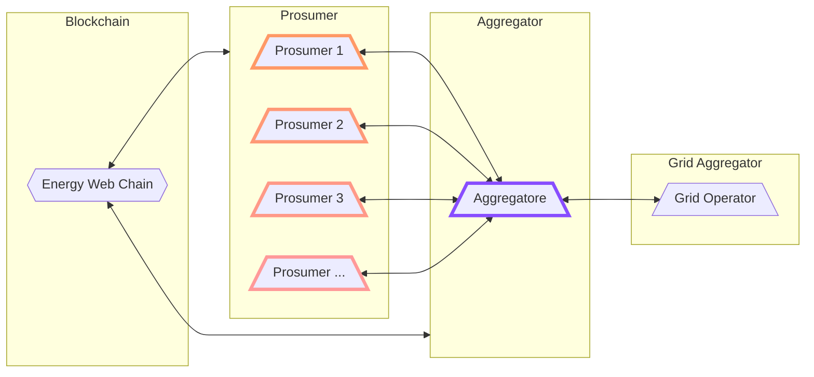

# Appunti EW

## Prosumer

Il *Prosumer* è l'appellativo riservato all'utente che usufruisce della rete elettrica. Può svolgere il ruolo di produttore o consumatore.
Ogni *Prosumer* fa capo ad un *Aggregatore*, con il quale stipula un contratto che stabilisce la produzione (o consumo) attesa e la flessibilità che il *Prosumer* si impegna a garantire. Nel caso di eventualità che impediscano al *Prosumer* di adempiere ai propri obblighi contrattuali o per sua scelta arbitraria, il *Prosumer* ha la possibilità di ri-negoziare il contratto.

Il tipo di fonte energetica usata dal produttore è registrato ed utilizzato per poter stimare il pattern di fornitura di energia, che, specie per alcune fonti rinnovabili, può essere anche molto variabile.

> Distribuzione di Poisson
>
> Includere le batteria nello schema del consumatore
>
> Distinguere i Prosumer con la loro fonte (eolico, solare, batteria)
>
> Distinguere la flessibilità (produzione o riduzione), con tariffe diverse

## Aggregatore

L'*Aggregatore* rappresenta il punto di riferimento diretto dei *Prosumer*. Il suo compito è quello di aggregare le letture provenienti dai dispositivi che hanno firmato un contratto con esso. Può così avere una visione d'insieme in tempo reale dello stato della rete elettrica sotto il suo controllo.

È possibile utilizzare le informazioni ottenute per profilare i *Prosumer*, ad esempio effettuare delle previsioni sulla fornitura in base alla fonte utilizzata per la produzione di energia.

La contabilità è gestita da uno smart contract che assegna token ai *Prosumer* secondo il contratto stipulato. Sono proprio questi token che possono poi essere riscattati per ricevere il compenso adeguato.

> p213[Ritardo massimo fra notifica ed erogazione] -> dalla richiesta del grid operator
>
> Le richieste di aggregazione avvengono una alla volta

## Richiesta di flessibilità

### Modello equo

Nel momento in cui il *Grid Operator* effettua la richiesta, l'*Aggregatore* emette un evento. A tutti i *Prosumer* viene richiesto di contribuire in proporzione alla flessibilità richiesta.

> I prosumer registrano su uno smart contract l'avvenuta accettazione della richiesta.
>
> Poi viene registrata l'avvenuta erogazione, specificando se questa ha soddisfatto i requisiti o meno con un margine di errore del 10%, e occupandosi di remunerare i Prosumer, segnalando tempistiche data, ora, flessibilità fornita

### Modello con reputazione

Ogni *Prosumer* ha un **punteggio di reputazione** che dipende da

- ottemperamento ai termini contrattuali **(+)**
- la sua partecipazione a richieste di flessibilità precedenti **(+)**
- revisioni al ribasso dei termini contrattuali **(-)**
- cattiva condotta nella fornitura di energia (penali) **(-)**

L'aggregatore procede in maniera sequenziale coinvolgendo i prosumer in or dine di **reputazione**. A parità di reputazione, si ordinano per flessibilità garantita.
Per permettere a tutti la possibilità di partecipare, si considera anche il costo dell'energia.

> Test con parametri artificiali ?

## Simulazione

Viene simulata una richiesta di flessibilità.

1. Si simulano un numero $n$ di *Prosumer*. 
   - Devono essere dotati di un account sulla Blockchain Volta
   - Devono avere a disposizione dei Volta token per poter invocare le funzioni degli smart contract
   - Devono avere una distribuzione verosimile, sia in quanto a fonte che a produzione
2. Il numero di *Prosumer* varia (aumenta) con il tempo, per mettere sotto stress il sistema
3. L'*Aggregatore* riceve le letture dai *Prosumer*
4. L'*Aggregatore* riceve le richieste di flessibilità dal *Grid Operator* e le inoltra ai *Prosumer*

### Distinguere i dati 
per frequenza
per sorgente
per imprevisto

## Eventi blockchain
- aggiunta DER 
- rimozione DER (contratto con scadenza!)
- rinegoziazione del contratto (e aggiornamento scadenza!)
- richiesta di flessibilità

## Interfaccia grafica parametrizzabile ??
Aggiungi DER
Rimuovi DER
Imprevisto DER

1. Startup aggregatore
2. Startup der (delay n ms) (partiamo da 10)
3. Si registrano sul contratto (parametri contratto)
4. L'aggregatore ottiene le informazioni sui contratti dalla blockchain
5. (Casuale) richiesta di flessibilità
    6. Strategia fair, (SEMPLIFICAZIONE: la modulazione sia sempre entro il 25% e tutti siano in grado di fornirla)
    7. Strategia reputazione
8. Leggendo dalla blockchain l'aggregatore conosce il risultato aggregato della flessibilità
9. (Casuale) rinegoziazione contratto
